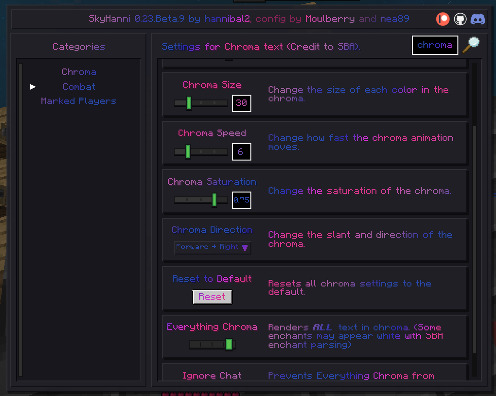

# Skyhanni Pride Flags



Be proud of who you are!

 - German
 - Persian
 - Romanian
 - Bisexual
 - Transsexual

Simply install this texture pack and have skyhanni installed and your chroma will be replaced with our custom colors.

By default this uses the bisexual flag, but you can change it by running the accompanying python script: 
```
python assets/skyhanni/shaders/edit-flag.py germany.txt
```

Then just reload your texture packs in game and you are good to go. (Note that this only works if you unpacked your texture pack, and you need to have python installed)


## Script directives

How to make your own flags:

`#abcdef` adds a new color. `#RRGGBB` hex color code.

`interpolation=<number>` sets the interpolation level. 0 is linear, everything else is exponential. use something like 10000 for flat bands, or 20 if you want somewhat nice looking results.

`maxsaturation` maxes out the saturation of all colors automatically.


